# Linie 8 — bus departures for Pebble Time 2

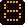

A Pebble watchapp that shows the next buses for your own routes, in local time for Wiesbaden (Germany),
no matter which time zone the watch is in. It started as a display for bus line 8 in Wiesbaden — hence the
name — and now handles any line and any pair of stops in the RMV area (Rhein-Main), with real-time delays.

## What it is for

**A fixed trip there and back, without changing.** For example into town and home again: you know your
start, you know where you are going, and you want to see at a glance when the next buses leave — in both
directions. Commuters and regulars, not trip planning: there is no journey planner and no connections with
transfers. Every route is a pair of stops served by at least one line directly.

Made together by **Seb & Claude** (Anthropic): ideas, design decisions and real-world testing by Seb,
code, tests and documentation by Claude in pair-programming sessions.

> **Status: beta, version 0.35.** Not yet tested in daily use — only in the emery emulator and with Node tests
> against live data. Version numbers start with 0 until the app has proven itself on the street. Releases
> published earlier as 3.2.0 to 3.4.0 are the same line of development (now 0.32 to 0.34).

<p>
  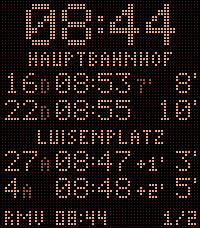
  &nbsp;
  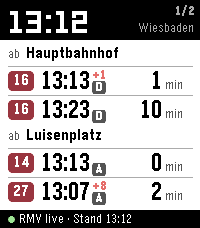
  &nbsp;
  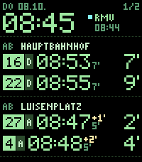
</p>

*Left: the default **LED view**, styled like a dot-matrix display at a bus stop. Middle: **Klar** ("clear")
with system fonts on white. Right: **Phosphor**, radar green on black in a pixel font. Same data: line,
platform, scheduled time, delay (`+1'`), travel time to the destination (`7'`) and minutes until departure
(`3'`) — with the delay included. The scheduled time stays as printed in the timetable; **the minutes until
departure are the number to go by**.*

## Features

- **Up to 8 routes.** A route is a pair of stops: departures from your start stop at the top, the way back
  at the bottom. Only direct connections are shown, so branching lines are handled correctly
- **Real-time data from RMV** (Rhein-Main-Verkehrsverbund) with delays and cancellations, if you add your own
  free RMV API key. Without a key, or if RMV fails, the app falls back to **[Transitous](https://transitous.org)**
  (timetable only, no key needed). The status line shows which source was used. You can also fix the source:
  *Auto* (default, as described), *RMV only* or *Transitous only*
- **Platform for every departure** (*Steig*), e.g. `D` at Wiesbaden Hbf — at stops with several platforms
  (A to D) you know where to wait. Real-time platform changes from RMV are taken into account. LED view:
  small and dimmed right after the line number, so `16 D` is not read as a line "16D"; Klar view: a small
  dark box below the delay
- **Return trip that fits how you move.** Board anywhere within 2 km of your destination (stroll through town
  first). By default the way back ends **exactly at your start**. Only if you choose it, the app also looks for
  buses that end within 500 m, 1 km or 2 km of the start — and then you pick the stop to get off yourself
  (the supermarket round the corner instead of your door). Nothing is widened automatically
- **Travel time to the destination** for every departure (`7'`), from real-time arrival minus real-time
  departure where available. Shown small next to the departure; the delay is coloured (LED: bright), the
  travel time grey (LED: dimmed). If space runs out, the travel time goes first — in the LED view that means
  it mostly shows only for buses on time. Can be switched off
- **Departure time as scheduled or as expected.** Default: the timetable time with the delay next to it
  (`10:43 +4'`). Alternative: the expected time with the delay already included (`10:47`), coloured in the
  Klar and Phosphor views. The minutes until departure always include the delay
- **Minutes with a tick everywhere:** `13'` until departure, `+1'` delay, `7'` travel time
- **Three views**, switchable on the phone or on the watch: LED (default), Klar and Phosphor
- **Set up routes right on the watch** — long-press Select opens a menu:
  new route from the stops near you, change the return stop or the start, delete. The phone does the
  searching, the watch only shows lists
- **Or set up routes on the phone** in the settings page of the Pebble app (no web hosting — the page is
  embedded in the app)
- **Wiesbaden time** computed on the watch itself (CET/CEST rule, no time zone database). When the watch is
  set to another time zone, the LED view shows `WI`
- Long stop names scroll like on a real platform display; scrolling stops after a minute to save battery

## Controls

| Button | Display | Menu |
| --- | --- | --- |
| Select | reload | choose |
| **Select, long press** | **open menu** | — |
| Up / Down | previous / next route | move (hold to scroll) |
| Back | quit | one step back |

<p>
  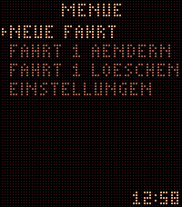
  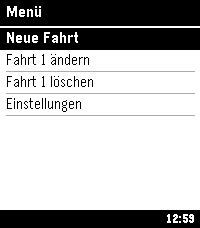
  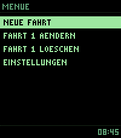
  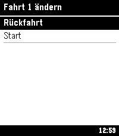
  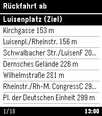
</p>

*Menu in both views, "change route", and the list of return stops within 2 km of the destination
(only stops with a direct connection back to the start).*

### New route on the watch

1. **Start** — the 10 nearest stops to your phone's location
2. **Line** — all lines from that stop, or *all lines*
3. **Direction** — only if you picked one line: one entry per terminus, e.g. `SONNENBERG BAHNHOLZ`. If the
   line runs to the same terminus on different routes, one entry per route, named after the first stop only
   that route serves (`EIGENHEIM UEBER DAMBACHTAL`). Skipped when there is only one direction
4. **Destination** — after a direction: **in the order the bus stops**, next stop first. With *all lines*
   (or *ALLE HALTE A-Z* at the end of the direction list): alphabetical, only stops *after* the start. With
   more than 40 destinations (busy stations) you pick the first letter first
5. **Return from destination?** — asked only if a bus goes from the destination directly back to the start
6. **Return stop** — otherwise: stops within 2 km of the destination with a direct connection back to
   exactly the start, sorted by distance. At the end of the list: *Umkreis 1 km* and *ohne Rückfahrt*
7. **Only if you choose *Umkreis*:** stops within 2 km of the destination whose bus ends within the radius
   around the start, then **where to get off** — the start first, otherwise sorted by distance to the start.
   You always confirm this step. Nothing found: a larger radius is offered
8. Saved, short names are generated automatically. The watch always queries exactly the saved pair of stops

### Radius around the start

- Phone: Pebble app → Linie 8 → settings → *Umkreis für die Rückfahrt* → 500 m, 1 km (default) or 2 km
- Watch: long-press Select → *Einstellungen* → *Umkreis*

The radius is only a search aid while setting up a route. It never changes a saved route.

### Settings

Watch: long-press Select → *Einstellungen*. Phone: Pebble app → Linie 8 → settings, same order
(*Anzeige auf der Uhr*, *Datenquelle*, *Umkreis für die Rückfahrt*). Two-way settings switch in place with
Select; the others open a list.

| Entry | Values | Default |
| --- | --- | --- |
| `ANSICHT` (view) | LED · Klar · Phosphor | LED |
| `ABFAHRT` (departure time) | Fahrplan (scheduled) · aktuell (expected) | Fahrplan |
| `FAHRTDAUER` (travel time) | an · aus | an |
| `QUELLE` (source) | Auto · nur RMV · nur Transitous | Auto |
| `UMKREIS` (radius, see above) | 500 m · 1 km · 2 km | 1 km |

<p>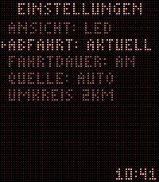</p>

Switching the view:

<p>
  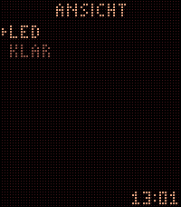
  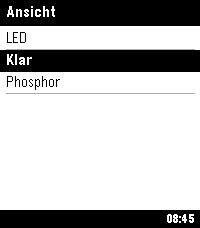
  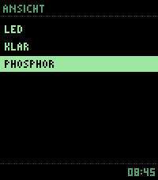
</p>

The watch remembers the view itself, so it starts in the right one even before the phone answers.

## Install

1. Download `linie8.pbw` from the [latest release](../../releases/latest)
2. Open it on your Android phone with the Pebble app (Core Devices) — it installs on the watch
3. Open the app on the watch, then add routes: long-press Select → *Neue Fahrt*, or via the settings page

Target platform: **emery** (Pebble Time 2, 200 × 228 px, 64 colours). The app has not been built for other
platforms.

### Optional: RMV API key for real-time data

1. Register for free at [RMV Open Data](https://www.rmv.de/s/de/rmv-open-data) and request an API key (`accessId`)
2. Enter it in the app's settings page on the phone and save

The key is stored only in the Pebble app on your phone. It is never part of the source code or the `.pbw`.
`tools/bauen.sh` refuses to build if it finds a test copy of your key anywhere in the source tree or in the
built app.

## Language

The user interface, the code comments and the identifiers are in **German** (the app is for a German
transit network). This README is in English.

| German | English |
| --- | --- |
| Strecke | route (pair of stops) |
| Fahrt / Rückfahrt | trip / return trip |
| Haltestelle, Ziel | stop, destination |
| Linie | line |
| Ansicht | view |
| Einstellungen | settings |
| Neue Fahrt / Fahrt ändern / Löschen | new route / change route / delete |
| fällt aus | cancelled |

## Building

Requirements (tested on macOS, without Homebrew):

- `pebble-tool` 5.0 with Pebble SDK 4.33 (`uv tool install pebble-tool --python 3.12`)
- Node.js for the tests
- a C compiler (`cc`) for the preview renderer

```bash
tools/bauen.sh          # build only, result in dist/linie8.pbw
tools/bauen.sh emu      # build and run in the emery emulator, with logs
tools/bauen.sh uhr <IP> # build and install via the phone (developer connection in the Pebble app)
```

The script builds in `~/.local/share/linie8-build/`, so no `build/` folder appears next to the sources.

### Preview without the SDK

`tools/vorschau/` contains a minimal stand-in for `pebble.h`. It compiles `src/c/main.c` on the Mac and
renders the LED and Phosphor views as a PNG in seconds — layout bugs show up here before the emulator.
(The Klar view uses system fonts and is checked in the emulator.) Environment variables: `LAYOUT=0|2`,
`VERSP`, `DAUER` (travel time), `STEIG`, `MODUS` for menus.

```bash
cd tools/vorschau && cc -I. -o /tmp/l8vorschau vorschau.c
/tmp/l8vorschau <now> <status> <count> <page> <dep1..3> <ret1..3> /tmp/l8.raw
python3 png.py /tmp/l8.raw preview.png
```

### Tests

```bash
node tools/test/ansicht_test.js   # view setting, phone ↔ settings page ↔ watch messages (offline)
node tools/test/seite_test.js     # settings page with live Transitous data
node tools/test/handy_test.js     # the whole watch menu flow with a simulated watch, live data
```

`handy_test.js` uses an RMV key if one is stored in `~/.config/rmv/accessId` (never printed); otherwise it
runs on Transitous only. Example routes are around Wiesbaden Hauptbahnhof.

## How it works

```
src/c/main.c                watch: LED raster, Klar and Phosphor views, menu and lists, time zone, buttons, AppMessage
src/c/led_font.h            generated LED font (tools/schrift_erzeugen.py)
src/pkjs/index.js           phone: routes, RMV/Transitous queries, message queue, menu state machine
src/pkjs/logik.js           shared by phone script and settings page: nearby stops, reachable destinations,
                            direct connections, short names
src/pkjs/einstellungen.html settings page (source); tools/seite_erzeugen.py embeds it with logik.js
tools/                      build script, preview renderer, generators, tests
```

- **Departures:** a journey search *start → destination with zero transfers* returns exactly the buses
  that stop at both stops. The platform comes with it: RMV `Origin.rtTrack`/`track`, Transitous `from.track`. Travel time: RMV
  `Destination.rtTime`/`time`, Transitous `endTime`, each minus the departure. Times travel as Unix seconds (UTC); the watch converts to Wiesbaden time
- **Watch menu:** the main menu and settings live on the watch; everything else (stop lists, lines,
  destinations, return stops) is computed by the phone and sent in blocks of 10 entries
- **Nearby stops:** Transitous `map/stops` (all stops in a bounding box), grouped by name
- **Destinations:** one Transitous `v6/stoptimes` request with `fetchStops=true` — departures come with their
  following stops (Wiesbaden Hbf: ~600 destinations in 0.2 s instead of up to 120 trip requests). In the evening
  a second window for the next midday adds daytime lines. `fetchStops` is marked experimental; if it disappears,
  the old way via trip requests takes over
- **Return trip:** arrivals at all stops within the radius around the start (`v6/stoptimes` with `radius` and
  `arriveBy`, two time windows), then one trip per line, terminus, direction *and* arrival stop — enough trips
  to cover every stop in the radius. Every stop *before* the arrival stop within 2 km of the destination is a
  candidate. This depends only on the start, so it is loaded in the background while you pick line and
  destination; the list for any destination is then computed locally in milliseconds
- **Messages** are sent strictly one after another with acknowledgement; the watch inbox is 2 KB because a
  full setup with 8 routes and names in both spellings is about 1.3 KB

### Pitfalls we ran into

| Problem | Fix |
| --- | --- |
| A platform letter right after the line number reads like a different line (`8B`) | platform drawn dimmed, LED pixels can be dimmed individually |
| `localeCompare(b, 'de', {numeric: true})` throws "Internal error. Icu error" in the emulator's JS | own German sort as fallback (`sortDe` in `logik.js`) |
| An exception inside a callback of the phone script fails silently, the watch waits forever | callbacks wrapped in `try/catch`, error shown as a list on the watch |
| Transitous rate-limits bursts (HTTP 429) | at most 4 requests in parallel, retry after 1/2/4 s |
| Transitous returns 403 without a User-Agent | send one |
| Transitous also lists car-pooling offers (mode `RIDE_SHARING`, no line name) | filtered out everywhere |
| One trip per line and terminus misses stops: some lines run two variants via different stops with the same terminus | one trip per line, terminus, direction and arrival stop, chosen greedily so few trips cover all |
| `arriveBy=true` in `stoptimes` searches backwards in time | add `direction=LATER` |
| Destinations per line mixed both directions (a stop reached by line 16 showed up under line 4, which only runs the other way) | lines per destination only from departures in travel direction |
| RMV does not allow browser requests (CORS) | all RMV calls from the phone script, not from the settings page |
| Inverted text in the LED raster is hard to read | selected row bright with an arrow, other rows dimmed |
| Umlauts cut in half at the buffer limit | truncate by UTF-8 bytes on the phone |
| Alloy (JavaScript on the watch) hits a "memory full" bug on the Pebble Time 2 | classic C SDK on the watch, PebbleKit JS on the phone |

## Data and credits

- [RMV Open Data](https://www.rmv.de/s/de/rmv-open-data) — HAFAS ReST API, real-time data (own key required)
- [Transitous](https://transitous.org) — community-run, MOTIS-based routing API; timetable data from DELFI
  (German national GTFS). Please be gentle with this free service
- Pebble SDK and the Pebble app by Core Devices / Rebble

## License

MIT — see [LICENSE](LICENSE).
