# Linie 8 — Abfahrten für die Pebble Time 2


Eine Pebble-App, die die nächsten Busse und Bahnen für deine Fahrten zeigt — in Wiesbadener Zeit, egal in
welcher Zeitzone die Uhr gerade steht. Angefangen hat sie als Anzeige für die Buslinie 8 in Wiesbaden, daher
der Name. Heute kann sie jede Linie und jede Haltestelle im RMV-Gebiet (Rhein-Main), mit Echtzeit-Verspätungen.

Gemacht von **Seb & Claude** (Anthropic): Ideen, Entscheidungen und Alltagstest von Seb, Code, Tests und
Dokumentation von Claude in gemeinsamen Sitzungen.

> **Stand: Beta, Version 0.51.** Geprüft im Emulator (emery) und mit Node-Tests gegen Live-Daten, noch nicht im
> Alltag auf der Uhr. Die Versionsnummern beginnen mit 0, bis sich die App auf der Straße bewährt hat.
>
> **Umstieg von 0.42 oder älter:** Seit 0.50 zeigt eine Seite nur noch **eine Richtung**. Die bisherigen
> Strecken (Hin- und Rückfahrt auf einer Seite) werden nicht übernommen — nach dem Update einmal neu anlegen.

<p>
  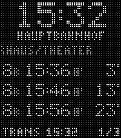
  &nbsp;
  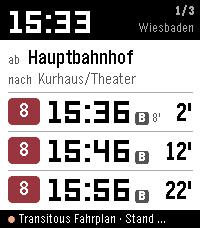
  &nbsp;
  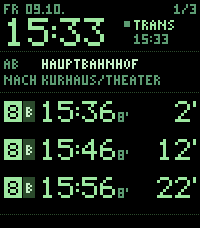
  &nbsp;
  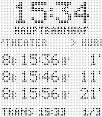
</p>

*Eine Seite mit Ziel in den vier Ansichten: Hauptbahnhof → Kurhaus/Theater, Linie 8. Von links: **LED**
(Standard, weiße Punkte wie an der Haltestelle), **Klar** (Systemschrift auf Weiß), **Phosphor** (Radar-Grün)
und **LED invers** (schwarz auf Weiß, für helles Tageslicht).*

## Inhalt

- [Wofür die App da ist](#wofür-die-app-da-ist)
- [Funktionen auf einen Blick](#funktionen-auf-einen-blick)
- [Installation](#installation)
  - [RMV-Schlüssel für Echtzeit](#rmv-schlüssel-für-echtzeit)
- [Bedienung](#bedienung)
  - [Tasten](#tasten)
  - [Die Anzeige lesen](#die-anzeige-lesen)
  - [Das Menü](#das-menü)
- [Anleitung](#anleitung)
  - [Neue Fahrt anlegen](#neue-fahrt-anlegen)
  - [Start im Umkreis](#start-im-umkreis)
  - [Seite ohne Ziel](#seite-ohne-ziel)
  - [Rückfahrt anlegen](#rückfahrt-anlegen)
  - [Abfahrten hier](#abfahrten-hier)
  - [Schnellere Abfahrt](#schnellere-abfahrt)
  - [Fahrt ändern oder löschen](#fahrt-ändern-oder-löschen)
  - [Startseite nach Standort](#startseite-nach-standort)
  - [Einstellungen](#einstellungen)
  - [Einrichtung am Handy](#einrichtung-am-handy)
- [Datenquellen](#datenquellen)
- [Selbst bauen](#selbst-bauen)
  - [Vorschau ohne SDK](#vorschau-ohne-sdk)
  - [Tests](#tests)
- [Wie es funktioniert](#wie-es-funktioniert)
  - [Stolperfallen](#stolperfallen)
- [Daten und Dank](#daten-und-dank)
- [Lizenz](#lizenz)

## Wofür die App da ist

**Feste Fahrten ohne Umstieg.** Zum Beispiel in die Stadt und wieder nach Hause: Du kennst deine Haltestelle,
du weißt, wohin du willst, und möchtest auf einen Blick sehen, wann die nächsten Busse fahren. Für Pendler und
Stammfahrer, nicht für die Reiseplanung — es gibt keine Verbindungssuche mit Umstieg.

Jede **Seite** zeigt eine Richtung: eine Haltestelle, darunter klein das Ziel, und die nächsten drei Abfahrten.
Ohne Ziel zeigt die Seite einfach alle Abfahrten der Haltestelle, jeweils mit der Endstation.

## Funktionen auf einen Blick

- **Bis zu 8 Seiten**, auf der Uhr mit hoch/runter zu blättern. Eine Seite ist Haltestelle + optional Ziel +
  Linien
- **Mit Ziel:** nur Fahrten, die direkt dorthin fahren — geteilte Linien werden so richtig erkannt. Dazu die
  **Fahrtdauer** bis zum Ziel
- **Ohne Ziel:** alle Abfahrten der Haltestelle mit der **Endstation** jeder Fahrt
- **Rückfahrt auf Knopfdruck** als eigene Seite, direkt hinter der Hinfahrt — genau zurück zum Start oder bewusst
  mit Ankunft im Umkreis
- **Abfahrten hier:** die nächste Haltestelle vom Standort, ohne eine Seite anzulegen
- **Startseite nach Standort:** Beim Öffnen springt die App auf die Seite, deren Haltestelle am nächsten liegt
- **Schnellere Abfahrt:** findet zur angezeigten Fahrt eine, die früher ankommt — auch von einer anderen
  Haltestelle in der Nähe und mit einer anderen Linie, Fußwege eingerechnet
- **Echtzeit vom RMV** mit Verspätungen und Ausfällen, wenn du einen eigenen (kostenlosen) RMV-Schlüssel
  einträgst. Ohne Schlüssel oder wenn RMV ausfällt: **Transitous** (nur Fahrplan, kein Schlüssel nötig)
- **Steig** zu jeder Abfahrt (z. B. `D` am Hauptbahnhof), mit Steigwechseln aus der Echtzeit
- **Vier Ansichten:** LED, Klar, Phosphor, LED invers — umschaltbar an Uhr und Handy
- **Einrichtung direkt an der Uhr** über das Menü, oder auf der Einstellungsseite in der Pebble-App am Handy
- **Wiesbadener Zeit** auf der Uhr berechnet (Sommer-/Winterzeit-Regel, keine Zeitzonen-Datenbank)
- Lange Haltestellennamen laufen durch wie an der Haltestelle; nach einer Minute halten sie an (Akku)

## Installation

1. `linie8.pbw` aus dem [neuesten Release](../../releases/latest) laden
2. Am Android-Handy mit der Pebble-App (Core Devices) öffnen — sie installiert die App auf der Uhr
3. App auf der Uhr öffnen und eine Seite anlegen: **Select lang drücken** → `NEUE FAHRT`

Zielplattform: **emery** (Pebble Time 2, 200 × 228 Pixel, 64 Farben). Für andere Uhren ist die App nicht gebaut.

### RMV-Schlüssel für Echtzeit

Optional, aber empfohlen — ohne Schlüssel gibt es nur Fahrplanzeiten.

1. Kostenlos bei [RMV Open Data](https://www.rmv.de/s/de/rmv-open-data) registrieren und einen Schlüssel
   (`accessId`) beantragen
2. In der Pebble-App am Handy: Linie 8 → Einstellungen → *Datenquelle* → Schlüssel eintragen, *Schlüssel prüfen*,
   *Speichern und an die Uhr*

Der Schlüssel liegt nur in der Pebble-App auf deinem Handy. Er steht nie im Quellcode und nie in der `.pbw`.

## Bedienung

### Tasten

| Taste | In der Anzeige | Bei „Abfahrten hier“ | Im Menü und in Listen |
| --- | --- | --- | --- |
| Select | neu laden | neu laden | auswählen |
| **Select lang** | **Menü öffnen** | Menü öffnen (verlässt „Abfahrten hier“) | — |
| Hoch / Runter | vorige / nächste Seite | vorige / nächstnähere Haltestelle | bewegen (halten = schnell) |
| Zurück | App beenden | zurück zu den Seiten | einen Schritt zurück |

### Die Anzeige lesen

**Seite mit Ziel**

```
        15:32            Uhrzeit Wiesbaden
     HAUPTBAHNHOF        Haltestelle
   > KURHAUS/THEATER     Ziel (klein, gedimmt)
 8 B 15:36 +1' 6'  4'    Linie, Steig, Abfahrt, Verspätung, Fahrtdauer, Minuten bis zur Abfahrt
 8 B 15:46     6' 14'
 8 B 15:56     6' 24'
 RMV 15:32         1/3   Quelle und Stand der Abfrage, Seite
```

- **Abfahrt:** Fahrplanzeit, dahinter die Verspätung (`+1'`). Wahlweise die erwartete Zeit mit eingerechneter
  Verspätung (Einstellung *Abfahrt*)
- **Minuten bis zur Abfahrt** (rechts, groß) enthalten die Verspätung immer — **das ist die Zahl, nach der du
  gehst**
- **Fahrtdauer** (klein, gedimmt) bis zum Ziel. Wird es eng, fällt sie zuerst weg
- **Steig** klein und gedimmt direkt hinter der Linie, damit `8 B` nicht als Linie „8B“ gelesen wird
- `FAELLT AUS` statt der Zeit, wenn der RMV die Fahrt als ausgefallen meldet
- Minuten tragen überall einen Strich: `4'` bis zur Abfahrt, `+1'` Verspätung, `6'` Fahrtdauer

**Seite ohne Ziel**

<p>
  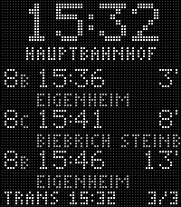
  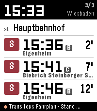
  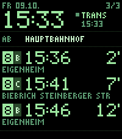
  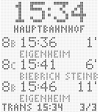
</p>

*Hauptbahnhof, Linie 8, ohne Ziel: unter jeder Abfahrt klein die Endstation (Eigenheim, Biebrich Steinberger
Straße). Keine Fahrtdauer — es gibt ja kein Ziel. In der LED-Ansicht werden lange Endstationen abgeschnitten.*

**Statuszeile**

| Anzeige | Bedeutung |
| --- | --- |
| `RMV 15:32` | Daten vom RMV, Stand 15:32. In Klar: „RMV live“ mit grünem Punkt |
| `TRANS 15:32` | Daten von Transitous (nur Fahrplan) |
| `LADE` | Abfrage läuft |
| `KEIN NETZ` / `FEHLER` | Handy nicht erreichbar oder Quelle hat nicht geantwortet — Select lädt neu |
| `2/5` | Seite 2 von 5 |
| `H1/10` | „Abfahrten hier“, nächste von 10 Haltestellen |
| `WI` | Die Uhr steht nicht auf deutscher Zeit; angezeigt wird trotzdem Wiesbadener Zeit |

### Das Menü

**Select lang** öffnet das Menü. Was darin steht, hängt von der aktuellen Seite ab:

| Eintrag | Wann | Was passiert |
| --- | --- | --- |
| `ABFAHRTEN HIER` | immer | Abfahrten der nächsten Haltestelle, nichts wird gespeichert |
| `SCHNELLERE ABFAHRT` | Seite mit Ziel | sucht eine Fahrt, die früher ankommt |
| `RUECKFAHRT` | Seite mit Ziel, weniger als 8 Seiten | legt die Rückfahrt als neue Seite an |
| `NEUE FAHRT` | weniger als 8 Seiten | legt eine neue Seite an |
| `FAHRT 2 AENDERN` | mindestens eine Seite | legt die Seite neu an, an derselben Stelle |
| `FAHRT 2 LOESCHEN` | mindestens eine Seite | löscht die Seite sofort, ohne Rückfrage |
| `EINSTELLUNGEN` | immer | Ansicht, Abfahrtszeit, Fahrtdauer, Quelle, Umkreis |

<p>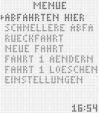</p>

Listen mit vielen Einträgen zeigen unten links die Position (`12/40`). Lange Einträge laufen in der gewählten
Zeile durch. Während das Handy rechnet, steht `LADE` mit einem Fortschritt; Zurück bricht ab.

## Anleitung

### Neue Fahrt anlegen

Select lang → `NEUE FAHRT`.

1. **Start** — die 10 nächsten Haltestellen vom Standort des Handys, mit Entfernung. Ganz oben steht
   `IM UMKREIS 1KM` (siehe [Start im Umkreis](#start-im-umkreis))
2. **Linie** — alle Linien ab dieser Haltestelle, oben `ALLE LINIEN`
3. **Richtung** — nur wenn du eine Linie gewählt hast und sie mehrere Richtungen hat: je Endstation ein Eintrag,
   z. B. `SONNENBERG BAHNHOLZ`. Fährt die Linie auf verschiedenen Wegen zur selben Endstation, gibt es je Weg einen
   Eintrag, benannt nach dem ersten Halt, den nur dieser Weg hat (`EIGENHEIM UEBER DAMBACHTAL`). Ganz oben
   `OHNE ZIEL`, ganz unten `ALLE HALTE A-Z`
4. **Ziel** — nach einer Richtung **in Fahrtreihenfolge**, nächster Halt zuerst. Sonst alphabetisch, nur Halte
   *nach* dem Start. Bei mehr als 40 Zielen (große Haltestellen) erst den Anfangsbuchstaben wählen. Ganz oben
   jeweils `OHNE ZIEL`
5. Die App prüft, welche Linien direkt zum Ziel fahren, und **speichert die Seite**. Kurznamen entstehen
   automatisch. Die Uhr zeigt sie gleich an

### Start im Umkreis

Für Orte, an denen du dich nicht auskennst: In Schritt 1 `IM UMKREIS 1KM` wählen.

1. Linie und Ziel wählst du aus **allem, was im Umkreis abfährt** — jede Linie an jeder Haltestelle im Umkreis,
   jedes Ziel, das sie anfahren
2. Danach kommt **Einstieg**: die Haltestellen im Umkreis, von denen es direkt zu deinem Ziel geht (mit der
   gewählten Linie), nächste zuerst, mit Meterangabe
3. Die gewählte Einstiegs-Haltestelle wird gespeichert

Den Umkreis (500 m, 1 km, 2 km) stellst du unter *Einstellungen* ein. `OHNE ZIEL` gibt es hier nicht — die
Haltestelle ergibt sich ja erst aus dem Ziel.

### Seite ohne Ziel

Wenn du an einer Haltestelle einfach sehen willst, was als Nächstes fährt:

1. `NEUE FAHRT` → Haltestelle wählen (nicht *Im Umkreis*)
2. Linie wählen oder `ALLE LINIEN`
3. In Richtung oder Ziel ganz oben `OHNE ZIEL`

Die Seite zeigt die nächsten drei Abfahrten mit Linie, Steig, Verspätung und Endstation. Mit einer gewählten
Linie kommen beide Richtungen; die Endstation zeigt, wohin der Bus fährt.

> Tipp: An großen Haltestellen (Hauptbahnhof: rund 40 Linien) sind drei Abfahrten aller Linien fast Zufall.
> Dort besser eine Linie wählen oder auf der Einstellungsseite am Handy Linien abwählen.

Rückfahrt und Schnellere Abfahrt gibt es für Seiten ohne Ziel nicht.

### Rückfahrt anlegen

Auf einer Seite mit Ziel: Select lang → `RUECKFAHRT`. Die neue Seite kommt **direkt hinter** die aktuelle.

1. **Rückfahrt ab** — Haltestellen bis 2 km um dein Ziel, von denen es **direkt genau zu deinem Start** zurückgeht.
   Das Ziel selbst steht oben (`(ZIEL)`), die anderen nach Entfernung. So kannst du erst durch die Stadt bummeln
   und woanders einsteigen
2. Ganz unten: `UMKREIS 1KM`. Nur wenn du das wählst, sucht die App auch Busse, die **im Umkreis um deinen
   Start** ankommen:
   - **Einstieg** — Haltestellen nahe dem Ziel mit so einer Fahrt
   - **Ausstieg** — der Start zuerst, sonst nach Entfernung zum Start. Zum Beispiel der Supermarkt um die Ecke
     statt der Haustür. Diesen Schritt bestätigst du immer selbst
   - Nichts gefunden: Ein größerer Umkreis wird angeboten
3. Gespeichert. Der Linienfilter der Hinfahrt gilt weiter, soweit diese Linien auch zurückfahren

Nichts davon passiert automatisch — ohne deine Wahl endet die Rückfahrt genau am Start. Zurück bricht ab.

<p></p>

### Abfahrten hier

Select lang → `ABFAHRTEN HIER` (ganz oben).

- Das Handy holt den Standort und zeigt die Abfahrten der **nächsten Haltestelle**: alle Linien, mit Steig,
  Verspätung und Endstation
- **Runter** zeigt die nächstnähere der 10 nächsten Haltestellen, **Hoch** die vorige. Unten rechts steht `H2/10`
- **Select** lädt neu, **Zurück** führt wieder zu deinen Seiten
- Es wird **nichts gespeichert**, keine der 8 Seiten wird belegt

<p>
  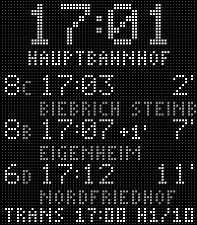
  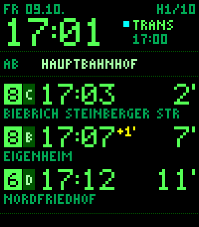
</p>

*Abfahrten hier am Hauptbahnhof (Beispieldaten aus der Vorschau).*

Gut zu wissen: Haltestellen mit zwei Namen (Bahnhof und Busbahnhof) sind in den Daten oft getrennt — dann einmal
Runter drücken.

### Schnellere Abfahrt

Auf einer Seite mit Ziel: Select lang → `SCHNELLERE ABFAHRT`.

1. **Schneller ab** — Haltestellen im Umkreis um deinen Start mit einer schnelleren Fahrt, die dir nächste zuerst
2. **Ausstieg** — Haltestellen im Umkreis um dein Ziel, das Ziel selbst zuerst
3. **Fahrten** — Linie, Abfahrt, Ankunft. Der Titel zeigt, wann dein üblicher Bus ankommt (`BISHER AN 10:51`)
4. Fahrt wählen → kleines Menü: `ZURUECK` (vorausgewählt) zeigt die Seite unverändert, `UEBERNEHMEN` ersetzt
   Einstieg, Ausstieg und Linie der Seite

Was als schneller zählt: Ankunft der Alternative **plus Fußweg** von ihrem Ausstieg zu deinem Ziel liegt vor der
Ankunft deines üblichen Busses. Dein üblicher Bus ist der erste, den du **zu Fuß noch erreichst**. Gehzeit:
Luftlinie mit 50 m pro Minute (etwa 4 km/h auf echten Wegen), ohne Puffer. Ist der Standort unbekannt oder weit
weg (Planung von zu Hause), rechnet die App so, als stündest du am Start. Alternativen kommen von Transitous,
dein üblicher Bus aus der gewählten Quelle (mit RMV in Echtzeit).

<p>
  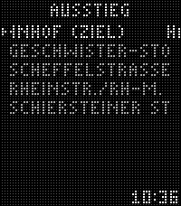
  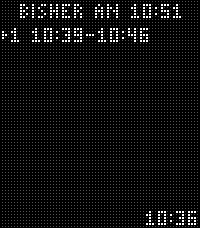
  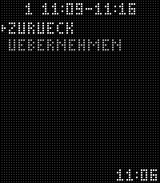
</p>

### Fahrt ändern oder löschen

- `FAHRT 2 AENDERN` startet den Ablauf von [Neue Fahrt](#neue-fahrt-anlegen); das Ergebnis ersetzt die Seite an
  derselben Stelle
- `FAHRT 2 LOESCHEN` löscht sofort, ohne Rückfrage — eine neue Fahrt ist schnell angelegt. Die übrigen Seiten
  rücken auf
- Die Reihenfolge der Seiten änderst du auf der Einstellungsseite am Handy (▲ ▼)

### Startseite nach Standort

Beim Öffnen der App fragt das Handy den Standort ab und springt auf die Seite, deren Haltestelle **am nächsten**
liegt. Morgens zu Hause die Hinfahrt, abends in der Stadt die Rückfahrt — ohne zu blättern.

- Hast du dich seit dem letzten Öffnen **kaum bewegt** (unter 300 m), bleibt die Seite vom letzten Mal
- Liegen mehrere Seiten gleich nah (dieselbe Haltestelle), bleibt die aktuelle, sonst gewinnt die zuletzt
  angesehene
- Sobald du eine Taste drückst, springt nichts mehr — die App reißt dir die Seite nicht unter dem Finger weg
- Die Reihenfolge der Seiten ändert sich dabei nie

### Einstellungen

An der Uhr: Select lang → `EINSTELLUNGEN`. Einträge mit zwei Werten schaltet Select direkt um, die anderen
öffnen eine Liste.

| Eintrag | Werte | Standard | Wirkung |
| --- | --- | --- | --- |
| `ANSICHT` | LED · Klar · Phosphor · LED invers | LED | Aussehen der Anzeige und der Menüs |
| `ABFAHRT` | Fahrplan · aktuell | Fahrplan | Fahrplanzeit mit `+2'` oder erwartete Zeit (in Klar orange, in Phosphor gelb) |
| `FAHRTDAUER` | an · aus | an | Minuten bis zum Ziel neben der Abfahrt |
| `QUELLE` | Auto · nur RMV · nur Transitous | Auto | Auto: RMV mit Schlüssel, bei Fehler Transitous |
| `UMKREIS` | 500 m · 1 km · 2 km | 1 km | so weit läufst du höchstens: Start im Umkreis, Rückfahrt mit Umkreis, Schnellere Abfahrt |

<p>
  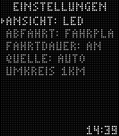
  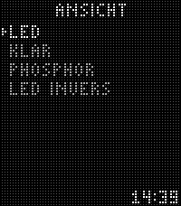
  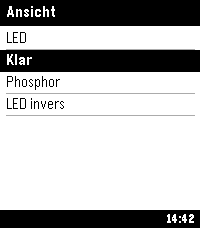
  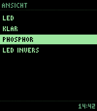
</p>

Die Uhr merkt sich die Ansicht selbst und startet gleich richtig, auch bevor das Handy antwortet.

### Einrichtung am Handy

Pebble-App → Linie 8 → Einstellungen (Zahnrad). Die Seite ist in die App eingebettet, es braucht kein Hosting.

- **Seiten:** Liste mit ▲ ▼ (Reihenfolge), *Bearbeiten*, *Löschen*, unten *+ Seite hinzufügen*
- **Seite anlegen:** Haltestelle (Suche oder *In meiner Nähe*) → Linie → Richtung → Ziel (optional, oben *Ohne
  Ziel*) → Linien auf dieser Seite (abwählbar) → Anzeigename mit LED-Vorschau
- **Anzeige auf der Uhr, Datenquelle mit RMV-Schlüssel, Umkreis** — dieselben Werte wie an der Uhr
- *Speichern und an die Uhr* überträgt alles

Rückfahrt, Start im Umkreis, Abfahrten hier und Schnellere Abfahrt gibt es nur an der Uhr.

## Datenquellen

| Quelle | Wofür | Echtzeit |
| --- | --- | --- |
| **RMV** (HAFAS ReST, eigener Schlüssel) | Abfahrten der Seiten, Abfahrten hier, Bezugsfahrt bei Schnellere Abfahrt | ja: Verspätung, Ausfall, Steigwechsel |
| **Transitous** (MOTIS, frei) | Rückfall für alles oben; Einrichtung (Haltestellen, Linien, Ziele, Rückfahrt-Suche), Alternativen bei Schnellere Abfahrt | nur Fahrplan |

Bei *Auto* kommt eine Seite immer vollständig aus einer Quelle: Schlägt RMV fehl, lädt die ganze Seite neu aus
Transitous. Die Statuszeile zeigt, welche Quelle geantwortet hat.

## Selbst bauen

Voraussetzungen (getestet auf macOS, ohne Homebrew):

- `pebble-tool` 5.0 mit Pebble SDK 4.33 (`uv tool install pebble-tool --python 3.12`)
- Node.js für die Tests
- ein C-Compiler (`cc`) für die Vorschau

```bash
tools/bauen.sh          # nur bauen, Ergebnis in dist/linie8.pbw
tools/bauen.sh emu      # bauen und im Emulator emery starten, mit Protokoll
tools/bauen.sh uhr <IP> # bauen und übers Handy installieren (Entwicklerverbindung in der Pebble-App)
```

Das Skript baut in `~/.local/share/linie8-build/`, neben den Quellen entsteht kein `build/`. Es bricht ab, wenn
es eine Test-Kopie des RMV-Schlüssels in den Quellen oder in der fertigen App findet, und entfernt die
Quellkarte (`.js.map`) aus der `.pbw`.

Oberfläche, Code, Kommentare und Bezeichner sind **deutsch** — die App ist für ein deutsches Verkehrsnetz.

### Vorschau ohne SDK

`tools/vorschau/` enthält einen schlanken Nachbau von `pebble.h`. Damit wird `src/c/main.c` auf dem Mac übersetzt
und die Ansichten LED und Phosphor in Sekunden als PNG gerendert — Layoutfehler sieht man hier vor dem Emulator.
Klar nutzt Systemschriften und wird im Emulator geprüft.

```bash
cd tools/vorschau && cc -I. -o /tmp/l8vorschau vorschau.c
/tmp/l8vorschau <jetzt> <status> <anzahl> <seite> <ab1..3> 0 0 0 /tmp/l8.raw [linien 1..3] [x x x] [name ziel]
python3 png.py /tmp/l8.raw vorschau.png
```

Umgebungsvariablen: `LAYOUT=0|2`, `STEIG="B,C,B"`, `VERSP="2,0,0"`, `DAUER="7,9,7"`, `ENDZIEL="A|B|C"` (Seite
ohne Ziel, Ziel leer übergeben), `HIER=10` (Abfahrten hier), `MODUS` für Menüs.

### Tests

```bash
node tools/test/ansicht_test.js   # ohne Netz: Ansicht, Seite ohne Ziel, Startseite nach Standort, größte Nachricht
node tools/test/seite_test.js     # Einstellungsseite mit Live-Daten: Seite mit und ohne Ziel
node tools/test/handy_test.js     # das ganze Uhr-Menü mit nachgebauter Uhr und Live-Daten
```

`handy_test.js` nimmt einen RMV-Schlüssel aus `~/.config/rmv/accessId`, falls vorhanden (wird nie ausgegeben),
sonst nur Transitous. Die Beispiel-Haltestellen liegen rund um den Wiesbadener Hauptbahnhof.

## Wie es funktioniert

```
src/c/main.c                Uhr: LED-Raster, Klar und Phosphor, Menü und Listen, Zeitzone, Tasten, Nachrichten
src/c/led_font.h            erzeugte LED-Schrift (tools/schrift_erzeugen.py)
src/pkjs/index.js           Handy: Seiten, RMV/Transitous-Abfragen, Nachrichten-Warteschlange, Menü-Ablauf
src/pkjs/logik.js           gemeinsam für Handy-Skript und Einstellungsseite: Haltestellen in der Nähe,
                            erreichbare Ziele, Direktverbindungen, Kurznamen, Seitenwahl nach Standort
src/pkjs/einstellungen.html Einstellungsseite (Quelle); tools/seite_erzeugen.py bettet sie mit logik.js ein
tools/                      Bauskript, Vorschau, Generatoren, Tests
```

- **Seite mit Ziel:** Verbindungssuche *Start → Ziel ohne Umstieg* — liefert genau die Busse, die an beiden
  Haltestellen halten. Steig und Fahrtdauer kommen mit (RMV `Origin`/`Destination`, Transitous `from`/`endTime`)
- **Seite ohne Ziel und Abfahrten hier:** RMV `departureBoard` (Endstation = `direction`), Transitous
  `v5/stoptimes` (`headsign`)
- **Zeiten** reisen als Unix-Sekunden (UTC), die Uhr rechnet in Wiesbadener Zeit um
- **Uhr-Menü:** Hauptmenü und Einstellungen kennt die Uhr selbst; alle anderen Listen rechnet das Handy und
  schickt sie in Blöcken zu 10 Einträgen
- **Haltestellen in der Nähe:** Transitous `map/stops`, nach Namen zusammengefasst
- **Ziele:** eine Transitous-Abfrage `v6/stoptimes` mit `fetchStops=true` — Abfahrten samt Folgehalten (Hbf:
  ~600 Ziele in 0,2 s). Abends kommt ein zweites Zeitfenster für den nächsten Mittag dazu
- **Rückfahrt:** Ankünfte an allen Haltestellen im Umkreis um den Start (`v6/stoptimes` mit `radius` und
  `arriveBy`), daraus je Linie, Endstation, Richtung und Ankunftshalt eine Fahrt. Jeder Halt *vor* der Ankunft bis
  2 km ums Ziel ist ein Kandidat
- **Startseite:** Standort vom Handy, nächste Seite per Luftlinie; die Uhr springt nur, solange keine Taste
  gedrückt wurde, und fordert die Seite dann selbst an
- **Nachrichten** gehen streng nacheinander mit Bestätigung. Der Empfangspuffer der Uhr ist 2 KB groß, weil die
  Einrichtung mit 8 Seiten und Namen in zwei Schreibweisen rund 1,3 KB braucht

### Stolperfallen

| Problem | Lösung |
| --- | --- |
| Ein Steig-Buchstabe direkt hinter der Linie liest sich wie eine andere Linie (`8B`) | Steig gedimmt, LED-Punkte einzeln dimmbar |
| `localeCompare(b, 'de', {numeric: true})` wirft im Emulator „Internal error. Icu error“ | eigene deutsche Sortierung als Rückfall (`sortDe` in `logik.js`) |
| Eine Ausnahme im Rückruf des Handy-Skripts bleibt stumm, die Uhr wartet ewig | Rückrufe in `try/catch`, Fehler als Liste auf der Uhr |
| Transitous drosselt Abfrage-Schübe (HTTP 429) | höchstens 4 parallel, neuer Versuch nach 1/2/4 s |
| Transitous antwortet ohne User-Agent mit 403 | eigenen mitschicken |
| Transitous listet auch Mitfahrangebote (`RIDE_SHARING`, ohne Liniennamen) | überall ausgefiltert |
| Eine Fahrt je Linie und Endstation verpasst Halte, weil Linien in Varianten fahren | je Linie, Endstation, Richtung und Ankunftshalt, gierig ausgewählt |
| `arriveBy=true` in `stoptimes` sucht rückwärts in der Zeit | zusätzlich `direction=LATER` |
| RMV erlaubt keine Browser-Abfragen (CORS) | alle RMV-Aufrufe aus dem Handy-Skript, nicht aus der Einstellungsseite |
| Invertierter Text im LED-Raster schwer lesbar | gewählte Zeile hell mit Pfeil, übrige gedimmt |
| Umlaute an der Puffergrenze halbiert | am Handy auf UTF-8-Bytes kürzen |
| Eine alte Antwort überholt eine neue (Seite gewechselt, Quelle umgestellt) | Laufnummer je Kanal, ältere Antworten verworfen |
| Alloy (JavaScript auf der Uhr) läuft auf der Pebble Time 2 in „memory full“ | klassisches C-SDK auf der Uhr, PebbleKit JS am Handy |

## Daten und Dank

- [RMV Open Data](https://www.rmv.de/s/de/rmv-open-data) — HAFAS-ReST-Schnittstelle, Echtzeitdaten (eigener
  Schlüssel nötig)
- [Transitous](https://transitous.org) — gemeinschaftlich betriebene, MOTIS-basierte Schnittstelle;
  Fahrplandaten von DELFI (deutschlandweites GTFS). Bitte schonend mit diesem freien Dienst umgehen
- Pebble SDK und Pebble-App von Core Devices / Rebble

## Lizenz

MIT — siehe [LICENSE](LICENSE).
